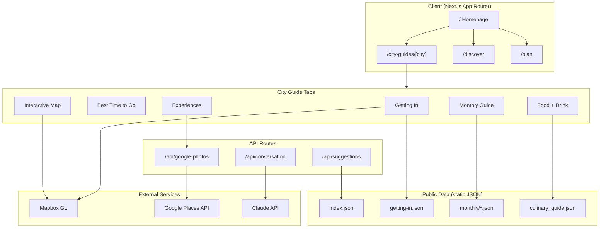
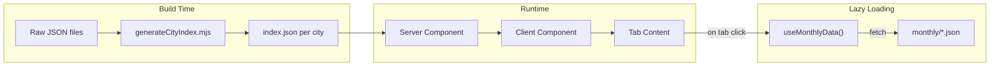

# Eurotrip Planner

A Next.js application for planning European travel, featuring AI-powered itinerary generation, city guides with curated experiences, and integration with Google Places for real-time photos.

## Architecture



## Data Flow



## Getting Started

```bash
npm install
npm run dev
```

Open [http://localhost:3000](http://localhost:3000).

## Environment Variables

Create `.env.local` with:

```env
GOOGLE_PLACES_API_KEY=your_key_here
# ... other keys (see .env.example if available)
```

## Features

### City Guides (`/city-guides/[city]`)

Comprehensive guides for 220+ European cities with:

- **Getting In** - Airport transport options with interactive route map, prose summaries, and transport cards showing price/duration
- **Best Time to Go** - Seasonal recommendations and visit calendar
- **Interactive Map** - Mapbox-powered map with attractions and neighborhoods
- **Monthly Guide** - What's happening each month, events, and seasonal tips
- **Experiences** - Curated activities across time-of-day categories
- **Food + Drink** - Restaurant recommendations with filtering by category and price
- **Photo Spots** - Instagram-worthy locations
- **Neighborhoods** - District overviews and local tips

### Discover (`/discover`)

Search and compare 220+ European cities with:

- AI-powered city scoring and ranking
- Filter by weather, budget, vibe, and more
- Scatter plot visualization

### Trip Planning

- **Start Planning** - Create new trips with AI assistance
- **Saved Trips** - View and manage saved itineraries
- **Roulette** - Random city selection for spontaneous travelers

## City Data Structure

City data lives in `public/data/{Country}/{city}/`:

```
public/data/
├── France/
│   └── paris/
│       ├── index.json                  # Consolidated city data
│       ├── getting-in.json             # Airport transport routes
│       ├── paris-experiences.json      # Curated experiences
│       ├── paris_culinary_guide.json   # Restaurant data
│       ├── paris_neighborhoods.json    # District info
│       ├── paris-visit-calendar.json   # Best times to visit
│       └── monthly/                    # Monthly guides
│           ├── january.json
│           └── ...
├── UK/
│   └── london/
│       └── ...
└── Spain/
    └── barcelona/
        └── ...
```

### Experiences JSON Format

Each city's `{city}-experiences.json` contains time-based categories:

```json
{
  "city": "Paris",
  "categories": {
    "Morning": [...],
    "Midday": [...],
    "Afternoon": [...],
    "Evening": [...],
    "LateNight": [...],
    "DayTrips_Seasonal": [...],
    "HiddenCorners": [...],
    "FoodDrink": [...],
    "ParksGardens": [...]
  }
}
```

Each experience includes:

| Field | Description |
|-------|-------------|
| `name` | Experience title |
| `description` | Detailed writeup |
| `tips` | Array of insider tips |
| `address` | Location |
| `lat`, `lon` | Coordinates |
| `themes` | Tags (e.g., "food", "architecture") |
| `pricing_tier` | free / budget / mid-range / premium |
| `scores` | Quality ratings (1-10) |
| `googlePlaceKey` | Key for Google Place ID lookup |

### Google Places Integration

Experiences display photos from the Google Places API instead of static images. The system:

1. Stores Google Place IDs in `public/data/google-place-ids.json`
2. Uses `googlePlaceKey` field to look up the Place ID
3. Fetches photos via `/api/google-photos` server proxy (keeps API key private)
4. Falls back to placeholder on error

#### Place ID Resolution Script

To resolve Google Place IDs for a city's experiences:

```bash
# Dry run (see what would be resolved)
node scripts/resolveExperiencePlaceIds.mjs --city paris --dry-run

# Resolve place IDs
node scripts/resolveExperiencePlaceIds.mjs --city paris

# With custom confidence threshold
node scripts/resolveExperiencePlaceIds.mjs --city london --confidence-threshold 0.7
```

Supported cities:
- `paris` (France)
- `london` (UK)
- `barcelona` (Spain)

The script:
1. Extracts venue names from experience titles
2. Searches Google Places API with location bias
3. Scores matches by name similarity + geographic distance
4. Writes Place IDs to `google-place-ids.json`
5. Adds `googlePlaceKey` to each experience

### Getting In Data

Airport transport data lives in `{city}/getting-in.json`:

```json
{
  "city": "paris",
  "cityCenter": { "name": "Central Paris", "coordinates": [2.3522, 48.8566] },
  "airports": [
    {
      "code": "CDG",
      "name": "Charles de Gaulle",
      "coordinates": [2.5479, 49.0097],
      "distanceKm": 25,
      "routes": [
        {
          "id": "cdg-rer-b",
          "type": "train",
          "name": "RER B",
          "duration": { "min": 35, "max": 50 },
          "price": { "amount": 11.80, "currency": "EUR" },
          "waypoints": [[2.5479, 49.0097], [2.3470, 48.8620]]
        }
      ]
    }
  ]
}
```

The interactive map:
- Zooms to selected airport when toggling CDG/ORY
- Draws all routes from selected airport (faded)
- Highlights specific route when transport option clicked

### Culinary Guide

The Food + Drink tab loads from `{city}_culinary_guide.json`:

```json
{
  "restaurants": {
    "fine_dining": [...],
    "casual_dining": [...],
    "street_food": [...],
    "coffee_culture": [...],
    "bars_nightlife": [...]
  }
}
```

Price filtering supports both `€` and `£` currencies.

## Project Structure

```
src/
├── app/                    # Next.js App Router pages
│   ├── api/               # API routes
│   │   └── google-photos/ # Photo proxy endpoint
│   ├── city-guides/       # City guide pages
│   ├── discover/          # City discovery
│   └── ...
├── components/
│   ├── city-guides/       # City guide components
│   │   ├── AttractionsList.js
│   │   ├── FoodDrinkGuide.js
│   │   └── ...
│   └── common/
│       └── GooglePlacePhoto.js
├── lib/
│   └── scoring/           # City scoring algorithms
└── generated/
    └── cities.json        # Auto-generated city list

scripts/
├── resolveExperiencePlaceIds.mjs  # Place ID resolver
└── generateCityList.mjs           # City list generator

public/data/
├── google-place-ids.json          # Centralized Place ID storage
└── {Country}/{city}/              # Per-city data files
```

## Adding a New City

1. Create the city directory:
   ```bash
   mkdir -p public/data/{Country}/{city}
   ```

2. Create required data files:
   - `{city}-experiences.json` - Curated experiences
   - `{city}_culinary_guide.json` - Restaurant data
   - `getting-in.json` - Airport transport routes (optional but recommended)

3. Add the city to `scripts/resolveExperiencePlaceIds.mjs`:
   ```javascript
   const CITY_CONFIG = {
     // ...existing cities
     yourcity: {
       country: 'Country',
       directoryName: 'yourcity',
       searchSuffix: 'City, Country',
     },
   };
   ```

5. Run the place ID resolver:
   ```bash
   node scripts/resolveExperiencePlaceIds.mjs --city yourcity
   ```

6. Test at `http://localhost:3000/city-guides/yourcity`

## Performance Optimizations

The city guide pages are optimized for fast load times through several techniques:

### Build-time Data Consolidation

City data is consolidated into a single `index.json` per city at build time:

```bash
node scripts/generateCityIndex.mjs
```

This combines all JSON files (overview, attractions, neighborhoods, monthly data, etc.) into one file, reducing SSR file operations from 10-15 down to 1-2.

### Manifest-based O(1) Lookups

The `src/lib/manifest.js` module provides cached, O(1) city lookups:

```javascript
import { getCityMeta, getCityPath } from '@/lib/manifest';

const meta = getCityMeta('paris'); // { country: 'France', directoryName: 'paris' }
const path = getCityPath('paris'); // /path/to/public/data/France/paris
```

### Client-side Optimizations

- **Throttled scroll handlers** - Uses `requestAnimationFrame` to avoid excessive re-renders
- **Memoized calendar data** - Pre-computes 365 days of visit calendar data once
- **Smart data loading** - Checks if SSR data exists before making client fetches
- **Eager component preloading** - Preloads StartHere and CityOverview on mount

### Key Performance Files

| File | Purpose |
|------|---------|
| `src/lib/manifest.js` | Cached manifest utilities for O(1) city lookups |
| `src/hooks/useMonthlyData.js` | Smart monthly data loading with SSR check |
| `scripts/generateCityIndex.mjs` | Build script for data consolidation |

## Tech Stack

- **Framework**: Next.js 15 (App Router)
- **Styling**: Tailwind CSS
- **Maps**: Mapbox GL
- **APIs**: Google Places (New), OpenAI/Anthropic
- **Database**: PostgreSQL (via Vercel)
