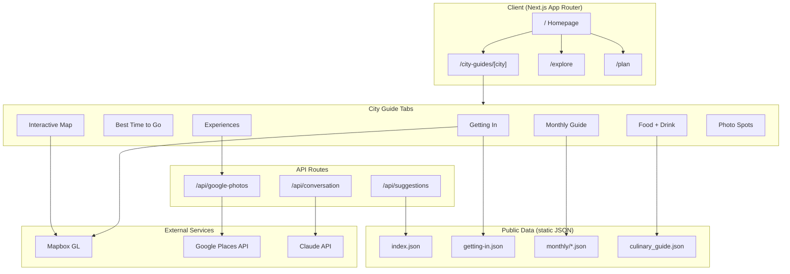
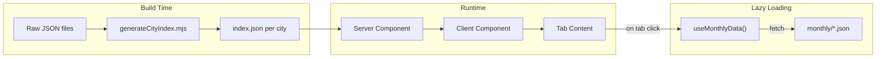

# Eurotrip Planner

A Next.js application for planning European travel, featuring AI-powered itinerary generation, city guides with curated experiences, real-time photos via Google Places, and **Olivier — a white-glove AI concierge** that sends scheduled, timezone-aware daily briefs (in-app, Web Push, email) and proactive weather alerts for your active trips.

## Architecture



## Data Flow



## Getting Started

```bash
npm install
npm run dev
```

Open [http://localhost:3000](http://localhost:3000).

## Environment Variables

Create `.env.local` with:

```env
GOOGLE_PLACES_API_KEY=your_key_here
ANTHROPIC_API_KEY=your_anthropic_key_here   # Claude — planner + concierge generation
NEXT_PUBLIC_MAPBOX_TOKEN=your_mapbox_token_here

# Supabase (auth + saved trips / wishlist + concierge persistence)
NEXT_PUBLIC_SUPABASE_URL=https://your-project.supabase.co
NEXT_PUBLIC_SUPABASE_ANON_KEY=your_supabase_anon_key_here
SUPABASE_SERVICE_ROLE_KEY=your_service_role_key_here

# Concierge — scheduling (Inngest). Local dev uses INNGEST_DEV=1 instead of keys.
INNGEST_EVENT_KEY=your_inngest_event_key
INNGEST_SIGNING_KEY=your_inngest_signing_key

# Concierge — Web Push (VAPID). Generate: node -e "console.log(require('web-push').generateVAPIDKeys())"
VAPID_SUBJECT=mailto:you@yourdomain.com
VAPID_PUBLIC_KEY=...
VAPID_PRIVATE_KEY=...
NEXT_PUBLIC_VAPID_PUBLIC_KEY=...            # = VAPID_PUBLIC_KEY

# Concierge — email (Resend) + reactive weather
RESEND_API_KEY=your_resend_key
FROM_EMAIL=Olivier <briefing@yourdomain.com>
OPENWEATHERMAP_API_KEY=your_owm_key         # reactive forecast monitor (v3)

# Optional: brief cache (Upstash Redis) + CDN for static assets/city data
UPSTASH_REDIS_REST_URL=...
UPSTASH_REDIS_REST_TOKEN=...
NEXT_PUBLIC_CDN_URL=https://your-distribution.cloudfront.net
```

Everything concierge-related degrades gracefully when its key is unset, so the
core app runs with just Google Places + Supabase. See `.env.example` and
[`CONCIERGE_RUNBOOK.md`](CONCIERGE_RUNBOOK.md) for the full set.

## Features

### City Guides (`/city-guides/[city]`)

Comprehensive guides for 220+ European cities with:

- **Getting In** - Airport transport options with interactive route map, prose summaries, and transport cards showing price/duration
- **Best Time to Go** - 12-month visit calendar with traveler-type filters, click-to-pin day tooltips (viewport-aware, Escape to close), and season-by-season narrative
- **Interactive Map** - Mapbox-powered map with attractions and neighborhoods
- **Monthly Guide** - What's happening each month, events, and seasonal tips
- **Experiences** - Curated activities across time-of-day categories
- **Food + Drink** - Restaurant recommendations with filtering by category and price
- **Photo Spots** - Iconic and hidden-corner shot locations with filters
- **Neighborhoods** - District overviews and local tips

Tab switches use React 18 `useTransition` with a thin top progress bar instead of a full-content skeleton swap, so the previous tab stays visible while the next one warms up. Per-section JSON is fetched lazily on the first tab open via `useCitySection()`.

### Discover (`/explore`)

Search and compare 220+ European cities on a unified map + list surface:

- AI-powered city scoring and ranking (`/api/suggestions`)
- Natural-language commands via the Discover command bar (`/api/discover/command`)
- Map view (default) or ranked list (`/explore?view=list`)
- Legacy `/results?start=…&end=…` and `/discover` redirect here

### Trip Planning

- **Start Planning** - Create new trips with AI assistance
- **Saved Trips** - View and manage saved itineraries
- **Roulette** - Random city selection for spontaneous travelers

### Concierge — "Olivier" (`/itineraries/[tripId]/concierge`)

A white-glove AI concierge wrapped around a saved trip. **Code owns the facts**
(times, weather, depart-by, the day's schedule, cadence); **Claude owns the voice**.

- **Personalized preview** — a rich, grounded taste of the daily rhythm built from
  the trip's real Day 1: an Evening Brief / Morning Wake-up / Wind-down (each with a
  glanceable push line, a "one delight", a decision prompt, the whole-day schedule,
  and a weather strip), a reactive "simulate a rainy afternoon" demo, a pre-seeded
  "Ask Olivier" chat, and the whole-trip rhythm timeline.
- **Real, autonomous delivery** — once a user opts in, Olivier sends the three daily
  beats on his own at the right **local time** per trip, across three channels:
  - **In-app** — a live navbar bell (Supabase Realtime).
  - **Web Push** — service worker + VAPID (`public/sw.js`).
  - **Email** — a designed Evening-Brief email via Resend.
- **Reactive (v3)** — a weather monitor checks each active trip's tomorrow; a material
  change (e.g. rain moving into an outdoor window) fires a proactive "the day changed"
  alert with a proposed reshuffle.

**Architecture:** generation lives in `src/lib/concierge/*`; delivery in
`notify.js`; scheduling + fan-out + retries via **Inngest** functions
(`src/inngest/functions/*`, served at `/api/inngest`); state in Supabase
(`concierge_preferences`, `concierge_notifications`, `push_subscriptions` — migrations
`0008`/`0009`).

> **To run it in production**, follow [`CONCIERGE_RUNBOOK.md`](CONCIERGE_RUNBOOK.md)
> (migrations + Inngest + VAPID + Resend). Design rationale is in
> [`CONCIERGE_PLAN.md`](CONCIERGE_PLAN.md).

## City Data Structure

City data lives in `public/data/{Country}/{city}/`:

```
public/data/
├── France/
│   └── paris/
│       ├── index.json                  # Consolidated city data
│       ├── getting-in.json             # Airport transport routes
│       ├── paris-experiences.json      # Curated experiences
│       ├── paris_culinary_guide.json   # Restaurant data
│       ├── paris_neighborhoods.json    # District info
│       ├── paris-visit-calendar.json   # Best times to visit
│       └── monthly/                    # Monthly guides
│           ├── january.json
│           └── ...
├── UK/
│   └── london/
│       └── ...
└── Spain/
    └── barcelona/
        └── ...
```

### Experiences JSON Format

Each city's `{city}-experiences.json` contains time-based categories:

```json
{
  "city": "Paris",
  "categories": {
    "Morning": [...],
    "Midday": [...],
    "Afternoon": [...],
    "Evening": [...],
    "LateNight": [...],
    "DayTrips_Seasonal": [...],
    "HiddenCorners": [...],
    "FoodDrink": [...],
    "ParksGardens": [...]
  }
}
```

Each experience includes:

| Field | Description |
|-------|-------------|
| `name` | Experience title |
| `description` | Detailed writeup |
| `tips` | Array of insider tips |
| `address` | Location |
| `lat`, `lon` | Coordinates |
| `themes` | Tags (e.g., "food", "architecture") |
| `pricing_tier` | free / budget / mid-range / premium |
| `scores` | Quality ratings (1-10) |
| `googlePlaceKey` | Key for Google Place ID lookup |

### Google Places Integration

Experiences display photos from the Google Places API instead of static images. The system:

1. Stores Google Place IDs in `public/data/google-place-ids.json`
2. Uses `googlePlaceKey` field to look up the Place ID
3. Fetches photos via `/api/google-photos` server proxy (keeps API key private)
4. Falls back to placeholder on error

#### Place ID Resolution Script

To resolve Google Place IDs for a city's experiences:

```bash
# Dry run (see what would be resolved)
node scripts/resolveExperiencePlaceIds.mjs --city paris --dry-run

# Resolve place IDs
node scripts/resolveExperiencePlaceIds.mjs --city paris

# With custom confidence threshold
node scripts/resolveExperiencePlaceIds.mjs --city london --confidence-threshold 0.7
```

Supported cities:
- `paris` (France)
- `london` (UK)
- `barcelona` (Spain)

The script:
1. Extracts venue names from experience titles
2. Searches Google Places API with location bias
3. Scores matches by name similarity + geographic distance
4. Writes Place IDs to `google-place-ids.json`
5. Adds `googlePlaceKey` to each experience

### Getting In Data

Airport transport data lives in `{city}/getting-in.json`:

```json
{
  "city": "paris",
  "cityCenter": { "name": "Central Paris", "coordinates": [2.3522, 48.8566] },
  "airports": [
    {
      "code": "CDG",
      "name": "Charles de Gaulle",
      "coordinates": [2.5479, 49.0097],
      "distanceKm": 25,
      "routes": [
        {
          "id": "cdg-rer-b",
          "type": "train",
          "name": "RER B",
          "duration": { "min": 35, "max": 50 },
          "price": { "amount": 11.80, "currency": "EUR" },
          "waypoints": [[2.5479, 49.0097], [2.3470, 48.8620]]
        }
      ]
    }
  ]
}
```

The interactive map:
- Zooms to selected airport when toggling CDG/ORY
- Draws all routes from selected airport (faded)
- Highlights specific route when transport option clicked

### Culinary Guide

The Food + Drink tab loads from `{city}_culinary_guide.json`:

```json
{
  "restaurants": {
    "fine_dining": [...],
    "casual_dining": [...],
    "street_food": [...],
    "coffee_culture": [...],
    "bars_nightlife": [...]
  }
}
```

Price filtering supports both `€` and `£` currencies.

## Project Structure

```
src/
├── app/                    # Next.js App Router pages
│   ├── api/               # API routes
│   │   └── google-photos/ # Photo proxy endpoint
│   ├── city-guides/       # City guide pages
│   ├── discover/          # City discovery
│   └── ...
├── components/
│   ├── city-guides/       # City guide components
│   │   ├── CityPageClient.js         # Tab orchestrator (useTransition)
│   │   ├── CityOverview.js           # Best-Time-to-Visit tab
│   │   ├── overview/                 # Calendar grid + tooltip + helpers
│   │   ├── foodDrinkGuide/           # Food + Drink tab
│   │   ├── photoSpots/               # Photo Spots tab
│   │   ├── monthlyTabbedView/        # Monthly Guide tab
│   │   └── ...
│   └── common/
│       ├── LazyComponents.js         # React.lazy() tab wrappers
│       └── GooglePlacePhoto.js
├── lib/
│   └── scoring/           # City scoring algorithms
└── generated/
    └── cities.json        # Auto-generated city list

scripts/
├── resolveExperiencePlaceIds.mjs  # Place ID resolver
└── generateCityList.mjs           # City list generator

public/data/
├── google-place-ids.json          # Centralized Place ID storage
└── {Country}/{city}/              # Per-city data files
```

## Adding a New City

1. Create the city directory:
   ```bash
   mkdir -p public/data/{Country}/{city}
   ```

2. Create required data files:
   - `{city}-experiences.json` - Curated experiences
   - `{city}_culinary_guide.json` - Restaurant data
   - `getting-in.json` - Airport transport routes (optional but recommended)

3. Add the city to `scripts/resolveExperiencePlaceIds.mjs`:
   ```javascript
   const CITY_CONFIG = {
     // ...existing cities
     yourcity: {
       country: 'Country',
       directoryName: 'yourcity',
       searchSuffix: 'City, Country',
     },
   };
   ```

5. Run the place ID resolver:
   ```bash
   node scripts/resolveExperiencePlaceIds.mjs --city yourcity
   ```

6. Test at `http://localhost:3000/city-guides/yourcity`

## Performance Optimizations

The city guide pages are optimized for fast load times through several techniques:

### Build-time Data Consolidation

City data is consolidated into a single `index.json` per city at build time:

```bash
node scripts/generateCityIndex.mjs

# Opt-in slim mode: drops `monthly` from index.json (~35% smaller for big cities).
# Monthly data is fetched lazily by useMonthlyData() from monthly/index.json.
EUROTRIP_INDEX_INCLUDE_MONTHLY=false node scripts/generateCityIndex.mjs
```

This combines all JSON files (overview, attractions, neighborhoods, monthly data, etc.) into one file, reducing SSR file operations from 10-15 down to 1-2.

### CDN Asset Strategy

Static images and JSON can be served from CloudFront via the helpers in
[`src/utils/cdnUtils.js`](src/utils/cdnUtils.js). To enable:

1. Sync assets to S3 (one-time):

   ```bash
   ./infra/sync-images.sh prod
   ./infra/sync-city-data.sh prod
   ```

2. Set `NEXT_PUBLIC_CDN_URL=https://<distribution>.cloudfront.net` in Vercel.

3. Optionally remove `public/images/` from the deploy (already excluded from
   server bundle tracing in `next.config.mjs`).

Modern image formats are negotiated automatically (`images.formats: ['image/avif', 'image/webp']` in `next.config.mjs`).

### Manifest-based O(1) Lookups

The `src/lib/manifest.js` module provides cached, O(1) city lookups:

```javascript
import { getCityMeta, getCityPath } from '@/lib/manifest';

const meta = getCityMeta('paris'); // { country: 'France', directoryName: 'paris' }
const path = getCityPath('paris'); // /path/to/public/data/France/paris
```

### Client-side Optimizations

- **Throttled scroll handlers** - Uses `requestAnimationFrame` to avoid excessive re-renders
- **Memoized calendar data** - Pre-computes 365 days of visit calendar data once
- **Smart data loading** - Checks if SSR data exists before making client fetches
- **Lazy section fetches** - `useCitySection()` pulls individual JSON sections on first tab open instead of shipping a full `index.json`
- **Non-blocking tab swaps** - `useTransition` keeps the previous tab interactive while the next one renders; a 2px progress bar at the top of the viewport signals pending work
- **Eager component preloading** - Preloads StartHere and CityOverview on mount

### Key Performance Files

| File | Purpose |
|------|---------|
| `src/lib/manifest.js` | Cached manifest utilities for O(1) city lookups |
| `src/hooks/useMonthlyData.js` | Smart monthly data loading with SSR check |
| `scripts/generateCityIndex.mjs` | Build script for data consolidation |

## Testing & CI

Pure modules under `src/lib/` are unit tested with Node's built-in test runner
(`node --test`, no extra dependencies). Tests live in `tests/`:

```bash
npm test
```

A GitHub Actions workflow (`.github/workflows/ci.yml`) runs lint, unit tests,
the data pipeline validator, and a `next build` on every PR.

A Husky `pre-commit` hook runs `eslint --fix` against staged source files via
`lint-staged`, so most issues are auto-fixed before they hit the remote.

## Tech Stack

- **Framework**: Next.js 15 (App Router), React 19
- **Styling**: Tailwind CSS
- **Maps**: Mapbox GL
- **AI**: Claude (Anthropic) — itinerary generation + concierge voice
- **APIs**: Google Places (New), OpenWeatherMap (reactive forecasts)
- **Auth + Database**: Supabase (auth, saved trips, wishlist, concierge state + Realtime)
- **Concierge backend**: Inngest (timezone-aware scheduling + fan-out + retries), Web Push (VAPID), Resend (email)
- **Cache**: Upstash Redis (optional, brief caching)
- **Hosting**: Vercel
